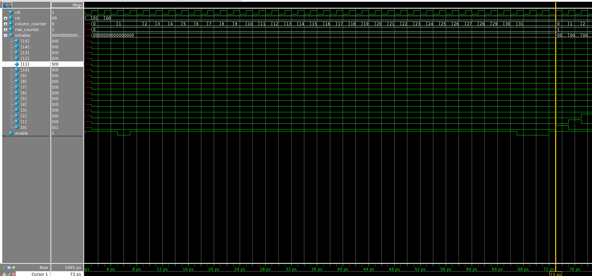
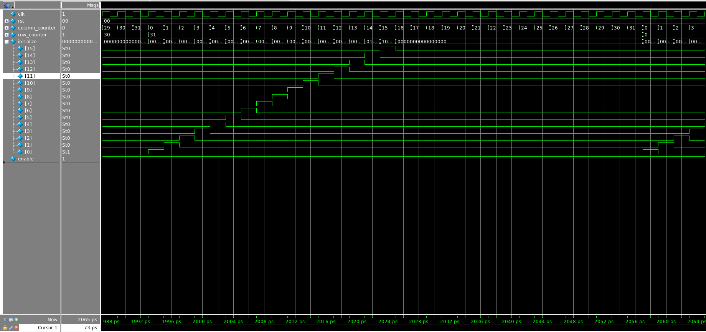
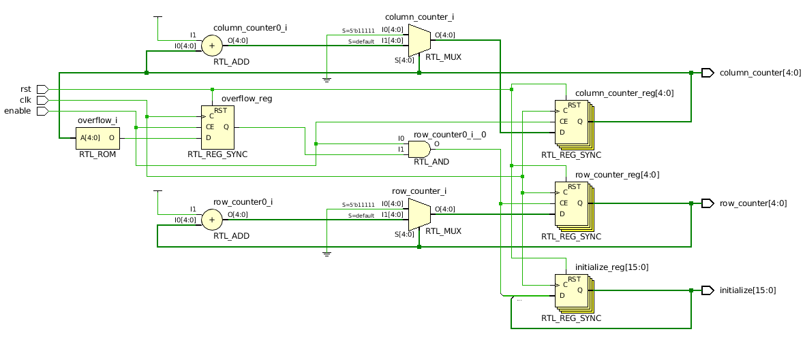

# LAB2 : Cascaded Counter module + Debugging FSM

Deadline: Please check LEARN for details

**Notice:** The content of this manual will be mantained in the lab manual posted on LEARN. The content found here is comprehensive but there may be minor updates throughout the term. Please, be aware of changes published on LEARN!

This lab contains two parts, part A is discussed below while part B is detailed further ahead in the document.

# LAB2 A: Cascaded Counter module [Design, Simulation and Synthesis]

## Getting started
First, clone the git repository onto your home directory on Docker container or the `eceubuntu` lab  server.

```
$ mkdir -p $HOME/ece327-s22/labs
$ cd $HOME/ece327-s22/labs
$ git clone ist-git@git.uwaterloo.ca:ece327-s22/labs/brayner-lab2.git
$ cd brayner-lab2
```

## Objective :

The objective of this lab is to introduce you to the Vivado synthesis tool and help you understand the results.
Specifically, you will design a "Cascaded Counter" for scanning elements of a 2D matrix. Such a counter arrangement is used to implement a nested for loop through a 2D image or matrix. You will first need to count columns in a row, and then increment rows once all columns in a row have been counted. You will also need a mechanism to indicate the start of a new row.
For this lab, a cascaded counter is a set of two counters chained together. The first counter (column counter) will run through its range of values, and once it reaches the end, it will generate an overflow signal. This overflow signal is wired to the second counter (row counter) as an enable signal.
You will also design a cascaded initialize signal. At the start of every new row (except the first) the first bit of the `initialize` signal should be asserted. Each successive bit of the `initialize` signal (up to the number of bits indicated by the `INIT_WIDTH` parameter) should follow the previous bit with one cycle of latency.

Specific tasks are below:

* Write Verilog code for the `counter.v` module that accepts an `enable` signal and generates two cascaded counter outputs `column_counter` and `row_counter`. 
* You code should also generate a `initialize` signal, that indicates the begining of a new row. The first bit of the `initialize` signal (i.e. `initialize[0]`) should be set to `1` for a single clock cycle after the value of `column_counter` is `WIDTH-1`. Later bits should follow, so `initialize[1]` is set to `1` one cycle after the start of a new row, `initialize[2]` is set to `1` two clock cycles after the start of a new row, and so on.
* The first counter is updated based on the rule `(column_counter + 1) % WIDTH`. The second counter is updated based on the rule `(row_counter + 1) % HEIGHT`.
* An `enable` input is provided to control the counting operation. When `enable` is deasserted **both** counters freeze their counts.
* Simulate your module in Modelsim for functional correctness by using the testbench provided. Ensure that the generated result matches the expected golden result provided.
* Synthesize your design in Vivado using the script provided to estimate the quality of generated hardware by referring to the utilization of resource report. Ensure no latches are created.

## Expected Behaviour :
* The `clk` signal is generated in the testbench and provided to your module. You are expected to operate on the positive edge of the clock. 
* The `rst` signal is asserted initially by the test bench for a single clock cycle. You are expected to reset **all** registers in your design to `0`.
* The `enable` is provided to control the counting operation.
* The two counter outputs and the `initialize` output need to be aligned properly as per the provided waveform below. 

### Expected Waveform: 

Observe the two Modelsim waveforms carefully. These waveforms assume WIDTH=32, and HEIGHT=32 for 5-bit counts.
- The first waveform shows the initial 30-40 cycles of operation. In particular note that `column_counter` is frozen at 31 when `enable` goes low and during that time `row_counter` **DOES NOT** increment. Observe carefully how the first bit of the `initialize` signal is not set while the counter is paused even though `column_counter` is `WIDTH-1`. Only the increment from `WIDTH-1` to `0` (the start of a new row) causes the `initialize` signal to begin its pattern. Also note that the initialize signal is not set for the first row.
- The second waveform simply shows the alignment between the two counters when both rollover at the end of their counting. The full `initialize` pattern can be seen as well.




The text trace below is the output of $display statements and captures the same information as the waveforms above. All values are decimial except for the `initialize` signal which is printed in binary.

```
# Time=1,Row=0,Column=0,Initialize=0000000000000000
# Time=3,Row=0,Column=0,Initialize=0000000000000000
# Time=5,Row=0,Column=1,Initialize=0000000000000000
# Time=7,Row=0,Column=1,Initialize=0000000000000000
# Time=9,Row=0,Column=2,Initialize=0000000000000000
# Time=11,Row=0,Column=3,Initialize=0000000000000000
# Time=13,Row=0,Column=4,Initialize=0000000000000000
# Time=15,Row=0,Column=5,Initialize=0000000000000000
# Time=17,Row=0,Column=6,Initialize=0000000000000000
# Time=19,Row=0,Column=7,Initialize=0000000000000000
# Time=21,Row=0,Column=8,Initialize=0000000000000000
# Time=23,Row=0,Column=9,Initialize=0000000000000000
# Time=25,Row=0,Column=10,Initialize=0000000000000000
# Time=27,Row=0,Column=11,Initialize=0000000000000000
# Time=29,Row=0,Column=12,Initialize=0000000000000000
# Time=31,Row=0,Column=13,Initialize=0000000000000000
# Time=33,Row=0,Column=14,Initialize=0000000000000000
# Time=35,Row=0,Column=15,Initialize=0000000000000000
# Time=37,Row=0,Column=16,Initialize=0000000000000000
# Time=39,Row=0,Column=17,Initialize=0000000000000000
# Time=41,Row=0,Column=18,Initialize=0000000000000000
# Time=43,Row=0,Column=19,Initialize=0000000000000000
# Time=45,Row=0,Column=20,Initialize=0000000000000000
# Time=47,Row=0,Column=21,Initialize=0000000000000000
# Time=49,Row=0,Column=22,Initialize=0000000000000000
# Time=51,Row=0,Column=23,Initialize=0000000000000000
# Time=53,Row=0,Column=24,Initialize=0000000000000000
# Time=55,Row=0,Column=25,Initialize=0000000000000000
# Time=57,Row=0,Column=26,Initialize=0000000000000000
# Time=59,Row=0,Column=27,Initialize=0000000000000000
# Time=61,Row=0,Column=28,Initialize=0000000000000000
# Time=63,Row=0,Column=29,Initialize=0000000000000000
# Time=65,Row=0,Column=30,Initialize=0000000000000000
# Time=67,Row=0,Column=31,Initialize=0000000000000000
# Time=69,Row=0,Column=31,Initialize=0000000000000000
# Time=71,Row=0,Column=31,Initialize=0000000000000000
# Time=73,Row=1,Column=0,Initialize=0000000000000001
# Time=75,Row=1,Column=1,Initialize=0000000000000010
.....
```

And, towards the end of the trace, you should see:
```
.....
# Time=2045,Row=31,Column=26,Initialize=0000000000000000
# Time=2047,Row=31,Column=27,Initialize=0000000000000000
# Time=2049,Row=31,Column=28,Initialize=0000000000000000
# Time=2051,Row=31,Column=29,Initialize=0000000000000000
# Time=2053,Row=31,Column=30,Initialize=0000000000000000
# Time=2055,Row=31,Column=31,Initialize=0000000000000000
# Time=2057,Row=0,Column=0,Initialize=0000000000000001
# Time=2059,Row=0,Column=1,Initialize=0000000000000010
# Time=2061,Row=0,Column=2,Initialize=0000000000000100
.....
```

## Expected synthesized design

In Vivado, once you have implemented your design correctly, you can check the `Schematic` view of your design. This can be activated by clicking _Open Elaborated Design->Schematic_ in the _Flow Navigator_ tab on the left. 
You can also observe how many LUTs and FFs have been generated by your implementation under the _Design Runs_ tab in the lower half of the GUI.



You should also open `utilization.txt` and confirm that you have the following number of FFs and LUTs. We will permit solutions that diverge by 3 LUTs and 3 FFs from this solution. If you violate both constraints, the synthesis component of grade is zero.

```
.....
+-------------------------+------+-------+-----------+-------+
|        Site Type        | Used | Fixed | Available | Util% |
+-------------------------+------+-------+-----------+-------+
| Slice LUTs*             |    7 |     0 |     53200 |  0.01 |
|   LUT as Logic          |    7 |     0 |     53200 |  0.01 |
|   LUT as Memory         |    0 |     0 |     17400 |  0.00 |
| Slice Registers         |   27 |     0 |    106400 |  0.03 |
|   Register as Flip Flop |   27 |     0 |    106400 |  0.03 |
|   Register as Latch     |    0 |     0 |    106400 |  0.00 |
| F7 Muxes                |    0 |     0 |     26600 |  0.00 |
| F8 Muxes                |    0 |     0 |     13300 |  0.00 |
+-------------------------+------+-------+-----------+-------+
.....
```

## Creating your design : 

Update the file called `counter.v` already provided in the repository. Only make changes to this file. The following are the I/O ports of the module :

1. `clk` : 1 bit input : This is the clock input to the module
2. `rst` : 1 bit input : This is a synchronous active high reset signal.
3. `column_counter` : log2(width) bits output : This is the output of the column counter.
4. `row_counter` : log2(height) bits output : This is the output of the row counter.
5. `enable`: 1 bit input: This signal determines whether the counter is updated.
6. `initialize`: `INIT_WIDTH` bits output: This is the output that indicates the start of a new row.

The column width (`WIDTH`), row height (`HEIGHT`) and number of `initialize` bits (`INIT_WIDTH`) are parameterised with a `parameter` declaration.
To compute the logarithm of the range (width, or height) we will use the `$clog2` Verilog system task that supplies this information at *compile time*.
You have previously seen system tasks like `$time` that are useful for simulation.
The `$clog2` task is also useful for synthesis to determine number of bits required.

Because the `initialize` signal has a number of bits that depends on the value of the `INIT_WIDTH` parameter, you will need to use a `for` loop (`generate` or otherwise) in order to implement the init propagation for the correct number of bits. **Important reminder:** delays (like `foo <= #2 bar`) cannot be synthesized in hardware. The increasing latency of each successive bit in the `initialize` signal should be because the signal is passed between registers, not because it was implemented using delays.

## Evaluating your design : 

### Simulation
To compile and simulate test your module, simply type `make modelsim`. Modelsim will start in GUI mode.

#### Using Xilinx simulator 
If you are facing troubles with Modelsim, you can simulate your design using
Xilinx's toolchain. To use Xilinx simulator type `make xsim` in your terminal.
Vivado will startup in GUI mode.


### Synthesis 

To run synthesis and generate the utilization report, simply type `make vivado`. Xilinx Vivado will start in GUI mode and launch synthesis. At the end of synthesis, Vivado will generate a file called `utilization.txt` in the same folder, with information about resource consumption of your design.

# LAB2 B: Debugging FSM

The objective of this part is to practice debugging and testing. The file `axis_pe.v` contains a Verilog implementation of an upcounter with an AXI-Streaming (AXIS) interface. AXIS is a simple and popular handshake-based streaming interface. In the most basic form, it has three signals - a multi-bit `data`, a 1-bit `valid`, and a 1-bit `ready`. The data is transferred from the source to the sink modules when both the `valid` and the `ready` signals are high. One of the requirements of the protocol is the ability of the sink to refuse the incoming data (stall the communication) by holding the `ready` signal low. You can read more about this protocol [here](https://developer.arm.com/documentation/ihi0051/a/Introduction/About-the-AXI4-Stream-protocol?lang=en) (Note: In this course we prefer source-sink terminology. The linked document uses master-slave terminology).

The given AXIS counter starts from `SEED` and counts up to `SEED+LENGTH-1`. The counter will continuosly try to send its current value in `m_axis_data`, by keeping `m_axis_valid` at 1 (so the upcounter is a source module in the AXIS connection). Whenever it is able to send its value, it increments for the next cycle. On the other hand, the counter must stop progressing if the sink is stalling communication.

You are also provided a testbench `axis_pe_tb.sv`, which you can use to simulate the counter with the `make axis_modelsim` or `make axis_xsim` commands. If you take a look at the testbench source code, you'll notice that it keeps a certain signal constant, while checking if the counter respects its specifications would benefit from varying this signal's value during the testbench. __*Your first task*__ is to modify the testbench so that said signal is toggled for a few cycles back and forth to trigger the bug. The ready signal must be toggled at least twice after the valid signal goes high.

Now, when you simulate the counter with the testbench + a GUI, you should be able to notice that there is a bug in the counter implementation provided to you in `axis_pe.v`, with respect to the specifications. __*Your second task*__ is to correct this bug in the file. Knowing what signals the bug is related to will help you navigate the file and find where to make changes. Your bug fix should not violate the AXIS protocol.

### Simulation
To simulate the AXIS counter with the given testbench, simply type `make axis_modelsim`. Modelsim will start in GUI mode.

If you are facing troubles with Modelsim, you can simulate your design using
Xilinx's toolchain. To use Xilinx simulator type `make axis_xsim` in your terminal.
Vivado will startup in GUI mode.

## Submitting your solution

Go to the cloned git repository for lab2.

For part A, you can update `counter.v` and ensure that (1) the test output matches the waveforms shown above, and (2) resource utilization is close to those reported in the synthesis logs shown above. Don't worry if the synthesis output does not exactly match our reported utilization.

For part B, you have to update `axis_pe_tb.sv` and `axis_pe.v` to (1) ensure that the testbench `axis_pe_tb.sv` can exercise the bug in file `axis_pe.v`, and (2) you have fixed the bug in `axis_pe.v`.

You can commit your design in two steps:
```
git commit -a -m "solution is ready for grading"
git push origin master
```

You may commit and push as many times are you want prior to submission deadline.

### Grading Policy

Look at the grade rule in Makefile. This is the script we will use to grade you
and we are giving you this script to self-assess.
- 15% of the lab grade will be reserved for `verilator -Wall -Wno-width --lint-only counter.v` generating an empty output. The lint checks help guard against bad coding practices.
- 30% of the lab grade will be reserved for passing simulation results `diff golden.txt result.txt` command. A `golden.txt` has been provided to help compute a `diff`. `result.txt` is generated from a Modelsim simulation. Our scripts will replace `dut_tb.v` so do not edit that file.
- 30% of the lab grade will be reserved for having synthesis results line up within 3 LUTs and 3 FFs of our reference solution. A `golden.utilization.txt` has been provided to help compute a `diff`. `utilization.txt` is generated from a Vivado synthesis run.

- 15% for fixing the testbench in `axis_pe_tb.sv` (first task).
- 10% for fixing the bug present in  `axis_pe.v` without violating AXIS protocol (second task).

- To grade your code, just type `make grade` and `cat grade.csv` to check your grade score. 
- Penalty for late submissions is 0% for the lab.
