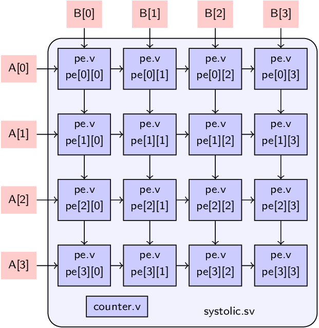
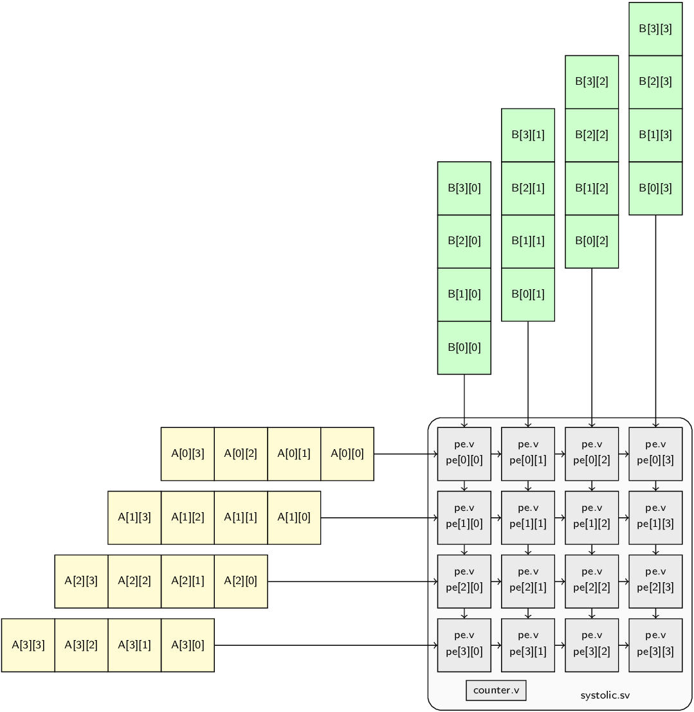
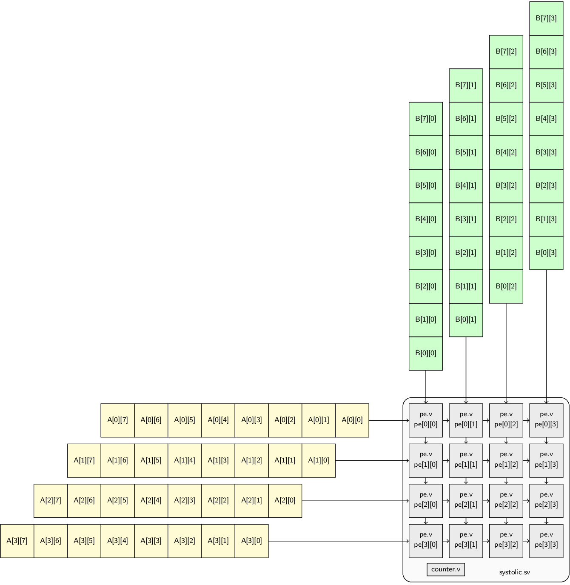
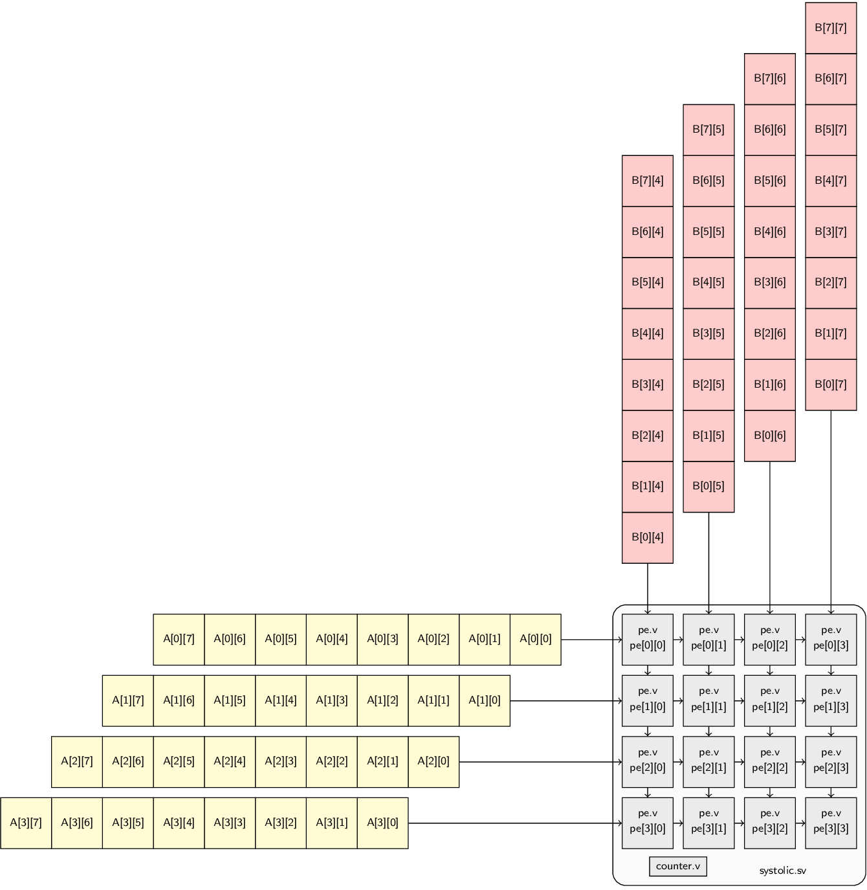
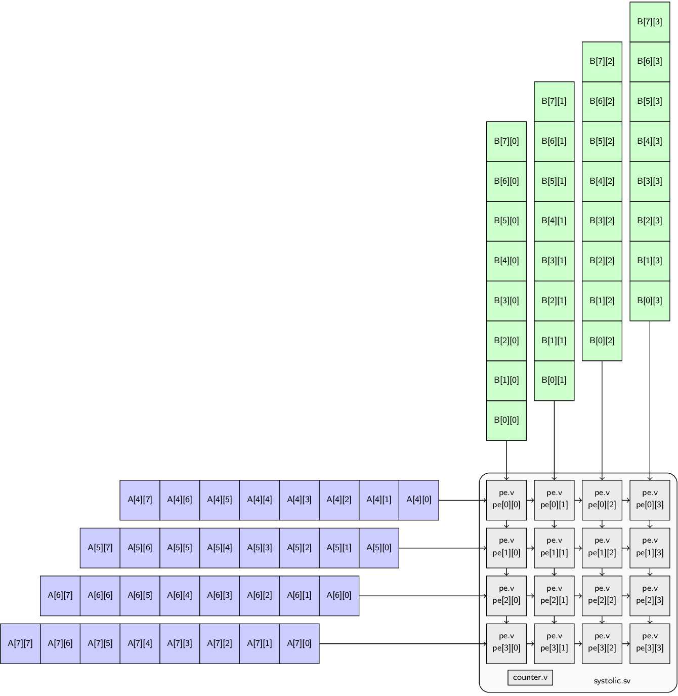
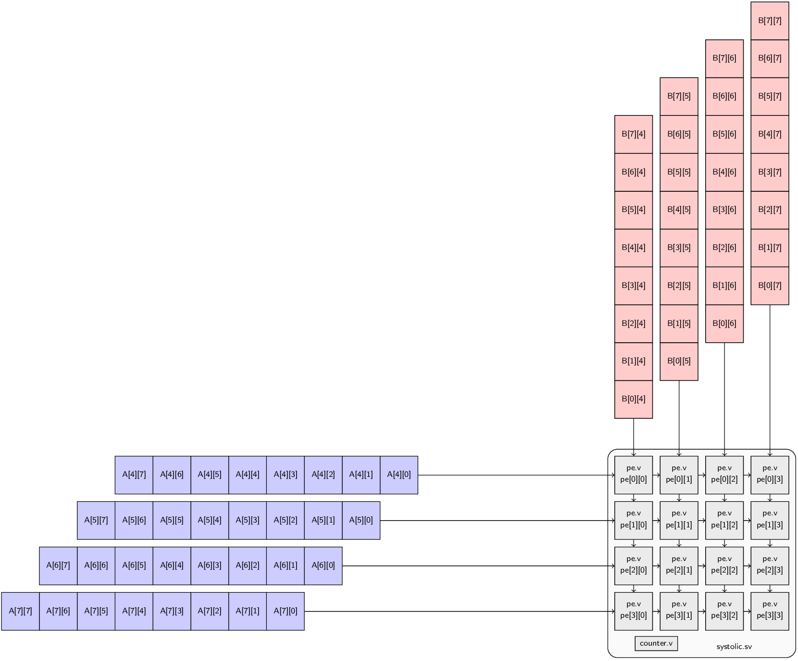
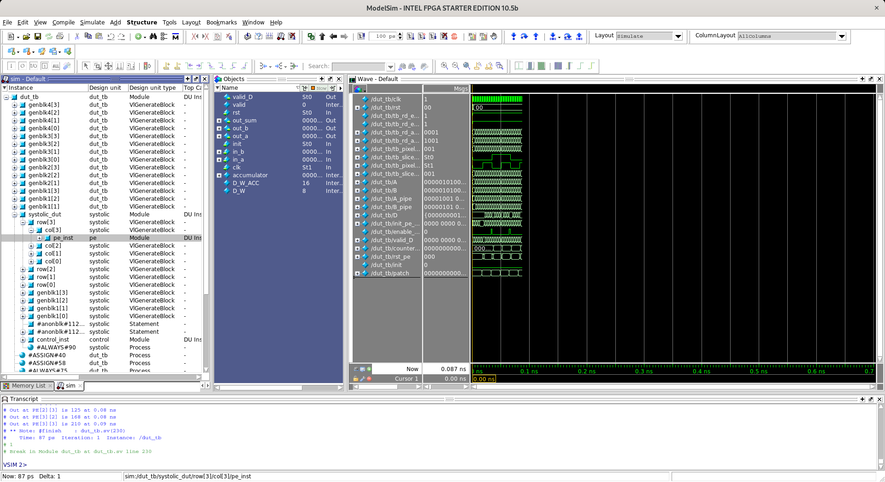

# LAB3 : Matrix Multiplication module [Design, Simulation, and Synthesis]

Deadline (3a): Please check LEARN for details

Deadline (3b): Please check LEARN for details

**Notice:** The content of this manual will be mantained in the lab manual posted on LEARN. The content found here is comprehensive but there may be minor updates throughout the term. Please, be aware of changes published on LEARN!


## Getting started
First, clone the git repository onto your home directory on Docker container or the `eceubuntu` lab  server.

```
$ mkdir -p $HOME/ece327-s22/labs
$ cd $HOME/ece327-s22/labs
$ git clone ist-git@git.uwaterloo.ca:ece327-s22/labs/brayner-lab3.git
$ cd brayner-lab3
```

## Objective :

Matrix multiplication is a popular kernel in high-performance scientific computing, gaming, and now even machine learning workloads. 
Companies like NVIDIA now build GPU hardware that excels at the task of performing matrix multiplication. 
In contemporary usage, matrix multiplication hardware has even made it into the core of the Google Tensor Processing Unit (TPU). 
FPGAs are also competent at matrix multiplication particularly from the perspective of energy efficiency.

The objective of this lab is to design a hardware module targeting FPGAs that can multiply two matrices in a systolic fashion. 
A systolic array is a 2D grid of simple computing elements connected to each other in nearest neighbour fashion. 
Dataflow through the array proceeds in a systolic fashion (one hop at a time), new elements injected into the array from the top and left flanks per cycle. 
The co-ordination of data injection is crucial for correct evaluation of the computation. 

Specific tasks are below: 

* Design a systolic matrix multiplication module in the file `systolic.sv` to instantiate a 2D grid of PEs defined in `pe.v`. You will need to use Verilog `generate` statements to construct the array of parametric dimensions. You will also need to create intermediate signals to help wire-up the systolic array correctly. The systolic core will also instantiate `control.v` to generate the control signals required to operate logic within the array.
* Implement the PE module `pe.v` that performs multiply-accumulate operation on streaming signals `in_a` and `in_b`. This is your Lab1 code with minor modifications to allow systolic assembly.
* Implement a cascaded counter module `counter.v` will implement a cascaded pixel/slice counter for two matrix inputs. This is based on your Lab2 code with modifications for left and top matrix customization.
* Simulate your module for functional correctness by using the testbench provided. Ensure that the generated result matches the expected golden result provided. Also ensure that the lint code quality checks are error-free.
* Synthesize your created design and estimate the quality of generated hardware by referring to the utilization of resource report.

## Design Description:

We will now investigate detailed operation of the systolic core, the PEs, and the counter. These components are the three key building blocks of your design. We show a high-level picture of the systolic array below:



### Systolic Core `systolic.sv`: 

The core computation for matrix multiplication is performed by a 2D systolic array with parameterizable design size NxN. The left column and top row of the array will stream input matrices `A` and `B`. The result matrix `D` is read from the 2D array in-place. For this lab, there is no readout circuit for sending `D` out of the array. 

### Building the systolic engine

The matrix inputs `A` and `B` will use the Verilog 2D array construct to supply multiple values to the systolic core per cycle. Each value has a configurable bitwidth `D_W` and the array will have a size equal to systolic lane count of _N_.
When connecting the external ports to the 2D grid of processing elements, you need to connect columns of `A[N-1:0]` and `B[N-1:0]` to the corresponding lanes of the design. For example, for a 4x4 systolic dimension, `A[0]` will connect to `PE[0][0]`, `A[1]` will connect to `PE[1][0]` as shown in the Figure above.

Then, we must connect the PEs in a systolic fashion to each other and include data forwarding logic to send the inputs to the next PEs along the row and column. You must use the Verilog `generate` construct to create a parametric 2D grid of PEs. Ensure that you declare internal 3D SystemVerilog signals to help stitch horizontal and vertical lanes of traffic. Again, you can refer to Lecture 3b for some hints of doing this. Each PE will store a partial product as the result of its multiply-accumulate operation. 
For our 4x4 systolic array, this will mean we will have 16 partial products at a point of time: One partial product for each PE. Once our four rows of `A` and four columns of `B` have been streamed in, distributed to the PE in systolic fashion, and streamed out, the resulting `D` output will be available "in-place" across all PEs. This is exposed as a SystemVerilog 3D port `D` at the top-level of `systolic.sv`. At his point, the testbench will read data from each PE in parallel via the `D` port and display the results on the terminal. 

### Streaming Matrices
So, how exactly are `A` and `B` streamed? This depends on the size of the systolic array NxN and the size of the matrices MxM. 

**M=N** case: For simplicity, first let us assume M=N=4 and the matrix dimensions match system size.

The matrix `A` will be streamed from the left of the 4x4 systolic array in a row-wise fashion. Each row of the systolic array will receive a streaming row of matrix `A`. Thus, we will read four rows of `A` in parallel with some offset.
The matrix `B` will be streamed from the top of the 4x4 systolic array in a column-wise fashion. Each column of the systolic array will receive a streaming column of matrix `B`. Thus, we will read four columns of `B` in parallel with some cycle.
For details of how this works, please refer to Lecture 3b: Top-Down Synthesis lecture.



**M>N case** Let us now consider the case where M>N i.e. matrices are larger than the systolic array size. We will restrict our discussion for cases where M is a multiple of N.

To control the access of correct pixel/slice indices, you must design two cascaded counters. These are pixel/slice counters that help stage the right row+column indices for each lane into the systolic array. It is important to get the counter operation right, as the test bench uses the counter values to decide which matrix entry to send to the appropriate lane of the systolic array. Only two counters are needed for M=N operation as you only read the same row once. The cascaded counters are important for cases when M>N as you have to reuse the systolic array to perform multiple NxN computations and slice the input matrices.

We can consider an example with M = 8 and N = 4, as shown in the images below to understand the concept of batching (or folding). Since M > N, it is clear that the entire matrix cannot simply be streamed to generate the multiplied output in one-shot. Instead, we break the input into batches of size NxM (4xM) for `A` and MxN (Mx4) for `B` and stream those sets of rows/columns into the array.  Here, computation will proceed in four phases.
Click on the images to expand them to full resolution.

Phase 1|  Phase 2 | Phase 3 | Phase 4
:----:|:----:|:----:|:----:
 |  |  |  |

* In the first phase, the yellow region will be multiplied the green. Here, the entire row and column will be streamed even through they are larger than the systolic array size. This is fine, as we are effectively processing the matrix in chunks.
* In the second phase, the yellow region will be multiplied by red. 
* In the third phase, the blue region will be multiplied with green. 
* Finally, the blue region will be multiplied by the red region.
	
Depending on the ratio of M/N, the number of such combinations will be (M/N)^2. 

The cascaded counters will help us in choosing the correct patch number for each matrix. Hence, the two cascaded counter instances the systolic design will generate four counts: `slice_cntr_A`, `pixel_cntr_A`, `slice_cntr_B`,
and `pixel_cntr_B`. Additionally, the systolic module will accept an enable signal: `enable` to ensure that the inputs can be inserted into the systolic array in co-ordinated fashion. When M=N, the slice counter for the `A` matrix will be held constant at 0, while pixel counter for `B` matrix will be held constant at 0.

Your systolic design should also output a 2D array of 1 bit :`valid_D` signal, signaling the testbench to read `D` for partial matrix products. Note that the `valid_D` signal should be asserted to match a diagonal wavefront propagating through the hardware. Each bit of the `valid_D` signal corresponds to the matrix product being ready at the corresponding PE.
(`valid_D[0][0]`->`PE[0][0]`, `valid_D[0][2]`->`PE[0][2]`)

### PE `pe.v`:

Your PE should accept two inputs: `in_a` and `in_b` at every clock cycle. It should perform multiply-accumulate operations on these inputs (Lab1). Additionally, your PE should be capable of streaming out the registered versions of `in_a` and `in_b`. Your PE should reset all its output (`out_sum`, `out_a`, `out_b`) on assertion of the 
`rst` signal. Whereas on the assertion of the `init` signal, only `out_sum` should start accumulating again. *Note*: You should not make `out_sum` zero on `init`, but rather you should start a new accumulation.
For this lab, we will not shift out the final accumulated results and they will stay in-place within the `out_sum` register. It is important that you generate an `valid_D` from each PE when the result of the dot product is ready for inspection by the external testbench.

A makefile target `test-pe` is provided to allow you to test the functionality of your PE module. The corresponding testbench instantiates a single PE and provides it with the sequence of `rst`, `init`, `in_a` and `in_b` inputs shown below, expecting the corresponding `out_sum` and `valid_D` outputs, where Dc means 'Don't care':

```
| time |   rst   |   init   |   in_a   |   in_b   |   out_a   |   out_b   |    out_sum   |    valid_D    | 
|------|---------|----------|----------|----------|-----------|-----------|--------------|---------------|
|  0   |    1    |    X     |    X     |    X     |     X     |     X     |        X     |        X      |
|  1   |    1    |    0     |    0     |    0     |     0     |     0     |       Dc     |        0      |
|  2   |    0    |    0     |    1     |    2     |     0     |     0     |       Dc     |        0      |
|  3   |    0    |    0     |    3     |    4     |     1     |     2     |       Dc     |        0      |
|  4   |    0    |    0     |    5     |    6     |     3     |     4     |       Dc     |        0      |
|  5   |    0    |    0     |    7     |    8     |     5     |     6     |       Dc     |        0      |
|  6   |    0    |    0     |    9     |   10     |     7     |     8     |       Dc     |        0      |
|  7   |    0    |    0     |   11     |   12     |     9     |    10     |       Dc     |        0      |
|  8   |    0    |    0     |   13     |   14     |    11     |    12     |       Dc     |        0      |
|  9   |    0    |    0     |   15     |   16     |    13     |    14     |       Dc     |        0      |
| 10   |    0    |    1     |   17     |   18     |    15     |    16     |       Dc     |        0      |
| 11   |    0    |    0     |   19     |   20     |    17     |    18     |      744     |        1      |
| 12   |    0    |    0     |   21     |   22     |    19     |    20     |       Dc     |        0      |
| 13   |    0    |    0     |   23     |   24     |    21     |    22     |       Dc     |        0      |
| 14   |    0    |    0     |   25     |   26     |    23     |    24     |       Dc     |        0      |
| 15   |    0    |    0     |   27     |   28     |    25     |    26     |       Dc     |        0      |
| 16   |    0    |    0     |   29     |   30     |    27     |    28     |       Dc     |        0      |
| 17   |    0    |    0     |   31     |   32     |    29     |    30     |       Dc     |        0      |
| 18   |    0    |    1     |   31     |   32     |    31     |    32     |       Dc     |        0      |
| 19   |    0    |    0     |   31     |   32     |    31     |    32     |     4968     |        1      |
| 20   |    0    |    0     |   31     |   32     |    31     |    32     |       Dc     |        0      |
| 21   |    0    |    0     |   31     |   32     |    31     |    32     |       Dc     |        0      |
| 22   |    0    |    0     |   31     |   32     |    31     |    32     |       Dc     |        0      |
| 23   |    0    |    0     |   31     |   32     |    31     |    32     |       Dc     |        0      |
| 24   |    0    |    0     |   31     |   32     |    31     |    32     |       Dc     |        0      |
| 25   |    0    |    0     |   31     |   32     |    31     |    32     |       Dc     |        0      |
| 26   |    0    |    0     |   31     |   32     |    31     |    32     |       Dc     |        0      |
| 27   |    0    |    0     |   31     |   32     |    31     |    32     |       Dc     |        0      |
| 28   |    0    |    0     |   31     |   32     |    31     |    32     |       Dc     |        0      |
| 29   |    0    |    0     |   31     |   32     |    31     |    32     |       Dc     |        0      |
| 30   |    0    |    0     |   31     |   32     |    31     |    32     |       Dc     |        0      |
```


### Control `control.v`:

The control file will generate the read (and later in Lab4 write) addresses for the input (and output) matrices. This is based on the cascaded counters you designed in Lab2. You will need those again. In addition, you have to generate the addressing logic to derive the actual memory address based on the counts. These are _combinational_ outputs.

The cascaded counters are used to indicate which entry of row/column is being fed into the systolic array. A separate counter is provided for `A` and `B` matrices.
For the `A` matrix shifted from the left, the pixel counter will loop through the different entries in a row. Different rows of the systolic array will be provided different rows of `A` with a cycle offset per row.
For M>N, the slice counter of the `A` matrix will increment after the pixel counter has counted through its range. The slice counter indicates which of the (M/N) NxM slice of matrix `A` that will be fed into the systolic core. The roles are reversed for the counter for `B`.

The cascaded counter accepts an `enable_row_count` control signal to allow the cascaded counter to increment. This is necessary to realize the (M/N)^2 partial product calculations needed on the systolic array.

For your understanding, the counter values for `A` and `B` are given below for M=8 and N=4. Refer to the diagram above and convince yourself that the counters should output these values. Again, a reminder that `A`'s slice counter counter counts the different patches (2 in this case). `A`'s pixel counter counts up-till M. B's slice counter counts up till M and `B`'s pixel counter counts the different patches (2 in this case).

While both the counter instantiations are provided in `control.v` with appropriate WIDTH and HEIGHT settings, it is helpful to fully grasp how the counters work. 
Note that only the counter instantiation is provided in `control.v` but you have to write the counter RTL yourself borrowing your Lab2 code and adapting as required. 


```
| time | slice_cntr_A  | pixel_cntr_A  | slice_cntr_B  | pixel_cntr_B  |  rd_addr_A  |  rd_addr_B  |
|------|---------------|---------------|---------------|---------------|-------------|-------------|
| 0    |      0        |      0        |      0        |      0        |     0       |     0       |
| 1    |      0        |      1        |      1        |      0        |     1       |     1       |
| 2    |      0        |      2        |      2        |      0        |     2       |     2       |
| 3    |      0        |      3        |      3        |      0        |     3       |     3       |
| 4    |      0        |      4        |      4        |      0        |     4       |     4       |
| 5    |      0        |      5        |      5        |      0        |     5       |     5       |
| 6    |      0        |      6        |      6        |      0        |     6       |     6       |
| 7    |      0        |      7        |      7        |      0        |     7       |     7       |
| 8    |      0        |      0        |      0        |      1        |     0       |     8       |
| 9    |      0        |      1        |      1        |      1        |     1       |     9       |
| 10   |      0        |      2        |      2        |      1        |     2       |    10       |
| 11   |      0        |      3        |      3        |      1        |     3       |    11       |
| 12   |      0        |      4        |      4        |      1        |     4       |    12       |
| 13   |      0        |      5        |      5        |      1        |     5       |    13       |
| 14   |      0        |      6        |      6        |      1        |     6       |    14       |
| 15   |      0        |      7        |      7        |      1        |     7       |    15       |
| 16   |      1        |      0        |      0        |      0        |     8       |     0       |
| 17   |      1        |      1        |      1        |      0        |     9       |     1       |
| 18   |      1        |      2        |      2        |      0        |    10       |     2       |
| 19   |      1        |      3        |      3        |      0        |    11       |     3       |
| 20   |      1        |      4        |      4        |      0        |    12       |     4       |
| 21   |      1        |      5        |      5        |      0        |    13       |     5       |
| 22   |      1        |      6        |      6        |      0        |    14       |     6       |
| 23   |      1        |      7        |      7        |      0        |    15       |     7       |
| 24   |      1        |      0        |      0        |      1        |     8       |     8       |
| 25   |      1        |      1        |      1        |      1        |     9       |     9       |
| 26   |      1        |      2        |      2        |      1        |    10       |    10       |
| 27   |      1        |      3        |      3        |      1        |    11       |    11       |
| 28   |      1        |      4        |      4        |      1        |    12       |    12       |
| 29   |      1        |      5        |      5        |      1        |    13       |    13       |
| 30   |      1        |      6        |      6        |      1        |    14       |    14       |
| 31   |      1        |      7        |      7        |      1        |    15       |    15       |
```


### Testbench Operation

We are providing you with a testbench to help verify operation of your systolic design.

The testbench will be primarily responsible for sending `A` and `B` test matrix data into the array, gathering the result `D`. We will verify correctness of operation by comparing the result with its expected value. We use `$readmemh` function to read matrix data into memories implemented in the test bench. In the end, this data is pushed out to a result file to assist correctness checks. 

The testbench also generates enable signals for your counters. The testbench will use your addresses for indexing into the matrix by the testbench. The testbench will also use the counters to identify the generation of partial matrix product. Whenever the column counter for `A` becomes `M`, this will mean that the complete patch has been pushed into the systolic array. At this instant, the testbench identifies the appropriate time for sampling `D` for partial matrix products by taking into account pipeline and inter-systolic delay. Recall that the results will be generated in the systolic array in a diagonal wavefront expansion fashion.

We supply test data in matrix files `A.mem` and `B.mem` that will be read by the test-bench code using `$readmemh` Verilog task.

### Expected Behavior

For these matrices, you should observe the following output for the command: `make modelsim-txt M=4 N=4`
```
# Out at PE[0][0] is 141 at 0.01 ns
# Out at PE[0][1] is 72 at 0.02 ns
# Out at PE[1][0] is 139 at 0.02 ns
# Out at PE[0][2] is 126 at 0.02 ns
# Out at PE[1][1] is 65 at 0.02 ns
# Out at PE[2][0] is 188 at 0.02 ns
# Out at PE[0][3] is 77 at 0.02 ns
# Out at PE[1][2] is 118 at 0.02 ns
# Out at PE[2][1] is 94 at 0.02 ns
# Out at PE[3][0] is 184 at 0.02 ns
# Out at PE[1][3] is 43 at 0.02 ns
# Out at PE[2][2] is 152 at 0.02 ns
# Out at PE[3][1] is 70 at 0.02 ns
# Out at PE[2][3] is 102 at 0.03 ns
# Out at PE[3][2] is 142 at 0.03 ns
# Out at PE[3][3] is 70 at 0.03 ns
```

We also provide a Python testing setup to help you generate new matrices. You can run `make test M=4 N=4` to better visualize input and output together, and confirm if it matches expected result.
```
Matrix 0 (A) is
[[ 5.  8.  5.  0.]
 [ 6.  4.  7.  0.]
 [ 7.  6.  3.  9.]
 [ 5.  4.  9.  5.]]
Matrix 1 (B) is
[[ 8.  7.  8.  0.]
 [ 7.  4.  7.  9.]
 [ 9.  1.  6.  1.]
 [ 7.  2.  4.  5.]]
Answer is
[[ 141.   72.  126.   77.]
 [ 139.   65.  118.   43.]
 [ 188.   94.  152.  102.]
 [ 184.   70.  142.   70.]]
Your answer is:
[[ 141.   72.  126.   77.]
 [ 139.   65.  118.   43.]
 [ 188.   94.  152.  102.]
 [ 184.   70.  142.   70.]]
##########
Thank Mr. Goose
##########
```

After running synthesis via `make vivado` (sets N=4, M=8),  you can open `utilization.txt` and confirm that you have the following number of FFs and LUTs. Make sure to keep `D_W=8` and `D_W_ACC=16` in `systolic.sv` top-level parameters. We will accept results within 25% of these reported numbers for "Slice LUTs" and "Slice Registers".

```
+-------------------------+------+-------+-----------+-------+
|        Site Type        | Used | Fixed | Available | Util% |
+-------------------------+------+-------+-----------+-------+
| Slice LUTs*             | 1405 |     0 |     53200 |  2.64 |
|   LUT as Logic          | 1405 |     0 |     53200 |  2.64 |
|   LUT as Memory         |    0 |     0 |     17400 |  0.00 |
| Slice Registers         |  727 |     0 |    106400 |  0.68 |
|   Register as Flip Flop |  727 |     0 |    106400 |  0.68 |
|   Register as Latch     |    0 |     0 |    106400 |  0.00 |
| F7 Muxes                |    0 |     0 |     26600 |  0.00 |
| F8 Muxes                |    0 |     0 |     13300 |  0.00 |
+-------------------------+------+-------+-----------+-------+
```

## Creating your design : 

### Design [Lab3a]
You have to create two documents -- `lab3.dot` and `lab3.json`.

1. [`lab3.dot`] Draw a high-level picture of your systolic array for 2x2 design and clearly label all connections between blocks and how they interact with the top-level `A` and `B` ports.
    A _graphviz_ template is provided. Edit this file using `vi` or `emacs` and run the following to generate a PDF diagram for submission. Only edit the `fillme` text labels.
    ```
    dot -Tpdf lab3.dot > lab3.pdf
    ```
2. [`lab3.json`] Draw a timing diagram for one complete execution of a 2x2 systolic array for a 4x4 matrix. The timing diagram should show symbolic values for each signal as computation proceeds through the systolic array. Assume that signals `in_a` and `in_b`, also declared in `systolic.sv`, are connected to the `in_a` and `in_b` inputs of each PE (for example, `in_a[0][0]` for the `in_a` input of the top-left PE at position `(0,0)`).
    You need to fill `lab3.json` in Wavedrom syntax for signals `init`, `valid_D`, and `D`. Compile this to PNG for submission. 
    ```
    wavedrom-cli -i lab3.json -p lab3.png
    ```

You may notice that because the testbench is synchronous, there is one cycle of latency between the address signals and the data provided to your module. You can assume (if it makes your design easier) that the data provided after reset is deasserted, and before the valid data, is always zero and therefore does not affect the result if your PEs begin accumulation immediately after reset.

### Complete Implementation [Lab 3b]

You must provide RTL implementations of the following designs with associated interfaces. Only make changes to these three files.

#### `pe.v`

1. `clk` : 1 bit input : This is the clock input to the module
2. `rst` : 1 bit input : This is a synchronous reset signal
3. `init` : 1 bit input : This is the init signal that flushes the accumulator
3. `in_a` : D_W bits input : This is the first PE operand.
4. `in_b` : D_W bits input : This is the second PE operand.
5. `out_sum` : D_W_ACC bits output : This is the resultant output of the MAC operation.
6. `valid_D`: 1 bit output: This indicates whether the output sum is valid after dot product.
7. `out_a` : D_W bits output : This is the output that streams out registered in_a
8. `out_b` : D_W bits output : This is the output that streams out registered in_b

#### `control.v`

1. `clk` : 1 bit input : This is the clock input to the module
2. `rst` : 1 bit input : This is a synchronous reset signal
3. `enable_row_count` : 1 bit input : Cascaded counting should only be enabled when this signal is asserted
4. `rd_address_a` : $clog2((M*M)/N) bits output: This indexes into the memory for A matrix. It is combinational (not registered).
5. `rd_address_b` : $clog2((M*M)/N) bits output: This indexes into the memory for B matrix. It is combinatinoal (not registered).
6. `pixel_cntr_A` : $clog2(M) bits output : Column pointer generated by counter associated with `A` matrix
7. `slice_cntr_A` : $clog2(M/N) bits output : Row pointer generated by counter associated with `A` matrix
8. `pixel_cntr_B` : $clog2(M/N) bits output : Column pointer generated by counter associated with `B` matrix
9. `slice_cntr_B` : $clog2(M) bits output : Row pointer generated by counter associated with `B` matrix


#### `systolic.sv` 

1. `clk` : 1 bit input : This is the clock input to the module
2. `rst` : 1 bit input : This is a synchronous reset signal
3. `enable_row_count_A` : 1 bit input : Enable counter operation for the cascaded counter (slice counter of `A`).
4. `A` : D_W bits x N bits input : `A`'s data lane to feed into systolic array
5. `B` : D_W bits x N bits input : `B`'s data lane to feed into systolic array
6. `pixel_cntr_A` : $clog2(M) bits output : Column pointer generated by counter associated with `A` matrix
7. `slice_cntr_A` : $clog2(M/N) bits output : Row pointer generated by counter associated with `A` matrix
8. `pixel_cntr_B` : $clog2(M/N) bits output : Column pointer generated by counter associated with `B` matrix
9. `slice_cntr_B` : $clog2(M) bits output : Row pointer generated by counter associated with `B` matrix
10. `D` : D_W_ACC bits x N bits x N bits : Connected to each PE's `out_sum` (`D[0][0]`->`PE[0][0]`, and so on)
11. `valid_D` : N bits x N bits output : Connected to each PE's `valid_D` (`valid_D[0][0]`->`PE[0][0]`, and so on)


## Evaluating your design : 

### Simulation

To test the functionality of your `pe` design, type `make test-pe`. Type `make sim-pe-modelsim` to simulate in GUI mode.

To compile and simulate your RTL design, simply type `make modelsim M=<value1> N=<value2>`. Modelsim will start in GUI mode. Please replace `<value1>` and `<value2>` with the value you wish to use.

To functionally test your design end-to-end from matrix multiplication operation using our Python test wrappers, use `make test M=<value1> N=<value2>`. This will first launch Modelsim to generate the output memory snapshot of the result matrix. Subsequently, a python script will compare your output memory with the correct result will let you know if there are any errors using friendly Waterloo syntax.

**Modelsim tip:** To look at signals for individual PEs, you will need to expand and click on the instance you want to look at in the `design hierarchy` tab, select signals from that instance in the `objects` tab and drag them to the `waveform` tab. It helps to name the for loops in your generate blocks so you don't have to guess which `genblk` each submodule belongs to.



### Synthesis 

To run synthesis and generate the utilization report, simply type `make vivado M=<value1> N=<value2>`. Xilinx Vivado will start in GUI mode and launch synthesis. At the end of synthesis, Vivado will generate a file called `utilization.txt` in the same folder, with information about resource consumption of your design.

## Submitting your solution

[Lab3a] Please discuss your design sketch with the lab TAs before you write any code. Please do this before midterm week.
```
$ make lab3a
$ git commit -a -m 'design documents are ready for inspection'
$ git push origin master
```

[Lab3b] Submit the RTL as per instructions below:

Please fill in your solution code in `pe.v`, `counter.v`, `control.v`, and `systolic.sv` files. Do not edit the cascaded counter instantiation in `control.v` You are expected to reuse and modify your RTL from Lab1 and Lab2 here. Ensure that (1) the test output matches the waveforms shown above, and (2) resource utilization matches those reported in the synthesis logs shown above. Don't worry if the synthesis output does not exactly match our reported utilization.

You can commit your design in two steps:
```
git commit -a -m "solution is ready for grading"
git push origin master
```
You may commit and push as many times are you want prior to submission deadline.

### Grading Policy

Look at the grade rule in Makefile. This is the script we will use to grade you
and we are giving you this script to self-assess.
- 5% of the lab grade is reserved for submitting a design document with relevant design details provided. It is OK for your design to have some flaws at this stage. We are here to help.
- 10% of the lab grade will be reserved for passing verilator lint checks on `pe.v`, `counter.v`, `control.v`, and `systolic.sv`. 
- 20% of the lab grade will be reserved for passing M=4 N=4 combination. Our scripts will replace `dut_tb.sv` so do not edit that file.
- 20% of the lab grade will be reserved for passing M=8 N=4 combination. Our scripts will replace `dut_tb.sv` so do not edit that file.
- 20% of the lab grade will be reserved for passing M=16 N=4 combination. Our scripts will replace `dut_tb.sv` so do not edit that file.
- 20% of the lab grade will be reserved for passing M=8 N=8 combination. Our scripts will replace `dut_tb.sv` so do not edit that file.
- 5% of the lab grade will be assigned to the synthesis results being within 10% of the reported utilization numbers for "Slice LUTs" and "Slice Registers".
- To grade your code, just type `make grade` and `cat grade.csv` to check your
- Penalty for late submissions is 0% of the grade. 
