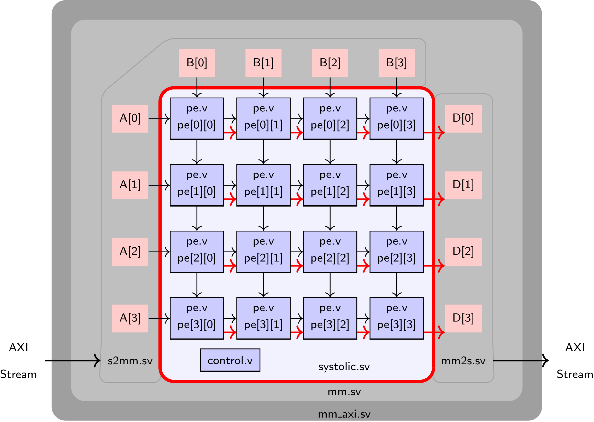

### Synthesis and Board Deployment

To run the design on the board, you will need to (1) generate FPGA bitstream, (2) copy bitstream to _Pynq_ board, (3) run python test code on the ARM CPU of the _Pynq_ board. 

#### Synthesis (1) 

To run synthesis and generate the bitstream, simply type `make vivado M=<value1> N1=<value2> N2=<value3>`. First, get the systolic designs working on the board for `M=4, N1=N2=4` and `M=8, N1=N2=4`.
Xilinx Vivado will start in GUI mode and launch synthesis as well as FPGA implementation to produce an FPGA bitstream. This will take 15-20 minutes. 
We have provided supporting infrastructure to help you interface between the ARM CPU to the FPGA. 
Everything outside the **red** rectangle in the figure below has been provided to you.



### Board Deployment (2) and (3)

Once the bitstream is generated, you can test this on the board with `make board M=<value1> N1=<value2> N2=<value3>` command.
Make sure the M/N values **match** the ones your used when you generated the bitstream.

Please test at least two bitstreams for the `M=4, N1=N2=4` and `M=8, N1=N2=4` cases.

## Optimizing your code

A key objective of this lab is to try and get you to (1) scale your design to
larger system size (in terms of the N1 x N2 array), and (2) improve the maximum operating
frequency of the design.

1. To improve the system size, you can read the FPGA datasheet for the device on the Pynq
   board to first identify upper limits of LUTs, FFs, DSPs and other resources.
   You must then strategize how to implement `pe.v` using a mixture of LUTs and
   DSPs. This is possible with the use of **use_dsp48** Verilog attributes in
   the right place in your code. Realistically, I do not expect you to go beyond
   N1=N2=25. If you surpass this figure, you will automatically be entered into the
   Hall of Fame (see below).

2. To improve FMAX, you must supply appropriate constraints to the CAD tool.
   This is done by configuring the frequency target in `overlay/tutorial.tcl` on
   the line `   CONFIG.PCW_FPGA0_PERIPHERAL_FREQMHZ {100} \`. On this line, you
   may change 100 MHz to a larger number. After that you can use FPGA
   floorplanning (see the Floorplanning lab manual) to help long wires avoid
   their long routes on the chip. Realistically I do not expect designs
   to go beyond 150 MHz. If you surpass this figure, you will automatically be
   entered into the Hall of Fame (see below). In addition, should you want to
   add _false paths_ you can enter those in `overlay/lab4.xdc` file. 

   **Interesting Information**: You may be piqued to know that this design
   operates off two clocks i.e. has two clock domains. One clock is for the
   write interface of `s2mm.sv` and the read interface of `mm2s.sv`. This allows
   the wrapper logic that feeds data to/from the CPU to operate at a lower clock
   frequency. This is fine because the data loading times are smaller than data
   computing times inside the `systolic.sv` core. This is particular true when
   we have data reuse for neural network computations. We isolate the faster
   clock `fclk` to drive `systolic.sv`, the read interface of `s2mm.sv` that
   feeds data into the systolic core, and write interface `mm2s.sv` that dumps
   resulting data into the output memories. Thus, you are free to optimize
   `fclk` without the _baggage_ of peripheral logic that you did not write.
   Furthermore, clock crossings typically need special care through the use of
   dual-rank synchronizers which you can find them on `start_multiply` and
   `done_multiply` signals if you are curious. Luckily the BRAM primitive
   naturally supports clock isolation between two clock domains by permitting
   separate read and write clocks to the RAM.

## Optimization guide [Lab4c]

Additionally, an optimization guide that describes what techniques were used
in previous years is provided in the `READMELab4c.md` file.

## Submitting your solution

Go to the cloned git repository for lab4. You are expected to use your RTL for
`pe.v`, `counter.v`, `control.v` and `systolic.sv` from Lab3 as a starting point for this lab.

You can then modify `pe.v` and `systolic.sv` to satisfy the new design requirements. Ensure that (1) your design passes the tests performed by the Makefile targets `test` and `test-mm-post-par` (for `M=4, N1=N2=4` and `M=8, N1=N2=4`), and (2) the output from the FPGA board matches the expected correct result as well.

You can commit your design in two steps:
```
git commit -a -m "solution is ready for grading"
git push origin master
```

You may commit and push as many times are you want prior to submission deadline.

We will generate FPGA bitstreams from your committed code for our internal
testing. Please keep a copy of your FPGA bitstreams on hand for the final demos.
DO NOT COPY bitstreams from any other team. We will confirm md5 checksum of the
bitstreams to ensure they come from your RTL.

### Grading Policy

To run the grading scripts, you will need to run `apt-get install bc` in the root shell of your Docker container. 

`make grade_a`, or `./grade.sh` gives you the following scores:
- 5% of the lab grade is reserved for verilator lint checks on `pe.v`, `counter.v`, `control.v`, and `systolic.sv`
- 30% of the lab grade will be reserved for functional correctness in simulation for the `M=4, N1=N2=4` and `M=8, N1=N2=4` cases.

`make grade_b`, or `./grade_board.sh` gives you the following scores:
- 35% of the lab grade will be reserved for functional correctness in hardware for the `M=4, N1=N2=4` and `M=8, N1=N2=4` cases. We will use the post-par timing simulation as fallback should FPGA deployments prove tricky this term.

`make grade_c` gives you the following scores:
- 15% of the final grade will be reserved for executing correctly on board with `M=4, N1=N2=4` and FMAX=100. 
- 15% of the final grade will be reserved for relative ranking between teams. 

The _relative rank_ between teams (of size 1 this term) will be computed based on the ability of teams to use the FPGA device in the fullest extent possible in two main ways: 
1. You have to try and fit the largest `N1 * N2` you can. The Zynq FPGA on the Pynq board has a certain number of LUTs, FF, DSPs, and BRAMs. This will limit what you can do, and some teams use a combination of resources to get larger `N1 * N2` values. See `READMELab4b.md` for hints on what techniques were used in previous years.
2. You have to maximize the operating frequency to the fullest extent possible. The device can support 200 MHz operation in some cases and 100 MHz operation should be trivially possible for anyone with one operational brain cell or two ::cough:: ::cough::.

These relative ranking component is worth 30 points. This is computed by `make grade_c` rule, or the `grade_bonus.sh` file. Make sure to edit the `design.txt` file with your largest, correctly-operational N1, N2 and FMAX numbers as show below.
```
$ cat design.txt
N1: 4 
N2: 4 
FMAX: 100
```
Obviously replace the 4 and 100 above with your rightful claims.

We will use following formula to rank teams `score = clock_frequency * sqrt(N1 * N2)`. 

Teams will get points based on this equation `points = 15+15*(your_score-100*4)/(max_score-100*4)`

- Team with the `score` value i.e. `max_score` will get full 30 points. 
- Teams that get 100 MHz operation and can fit N1=N2=4 will achieve a score of `100*4` and will get a default 15 points.

Teams from each year that surpass the best-observed results so far  will enter this pantheon of glory.

🏆🏆 **Leaderboard** 🏆🏆

Year        | Team                     | Spec               |
:----------:|:------------------------:|:------------------:
Winter 2019 | Yifei Li + Salam Nachawi | N1=N2=25, FMAX=115MHz  |
Spring 2019 | Monta Gao + Dan Timonera + Mehdi Abbasi Azadgoleh + Muhammad Gill | N1=N2=29, FMAX=111.11MHz  |
Fall 2019   | Ian + Nimesh             | N1=N2=27, FMAX=142MHz  |
Spring 2020 | (individual) Thomas Kidd, Andrew Rae, (honorable mention) Julian Parkin | N1=N2=29, FMAX=200MHz (150 MHz for honorable mention)  |

## LAB4 - Timing Simulations

### Understanding timing simulations 
The files in this folder are debugging scripts meant to help reconcile differences between simulation and post-synthesis, or post-implementation bugs. You *may* have a scenario where your design works fine in the test framework supplied to you in simulation. However it does not work in hardware.

There are two steps to diagnosing the fault.

A. First try to simulate the design with our provided `mm.sv` wrappers. This will ensure that you are interfacing with our framework correctly.

B. Next, if that works, and your design still behaves oddly when mapped to hardware, you will need to try a (1) post-synthesis simulation, and a (2) post-implementation simulation. Here we run Vivado to compile our designs and write out Verilog code of the optimized designs after synthesis and implementation respectively. 


### Running Post-Synth/Post-Impl Simulations

First run step (A), simulation with `mm.sv` wrappers, with the rule `make test-mm M=4 N1=4 N2=4`. You can switch around M/N1/N2 values to suit your debug needs.

Next, to run step (B1), post-synthesis simulation, run the rule `make test-mm-post-synth`. This will run Vivado until the `synth_design` step. This is adequate for detecting simple RTL coding style bugs that result in incorrect hardware generation. The netlist contains LUTs, FFs, DSPs, BRAMs, and other FPGA components. Each component has a Verilog simulation model with detailed timing information. You may need to adjust the `clk` and `fclk` periods in `mm_tb.sv` to avoid timing errors.

Finally, if board execution fails, run step (B2), for post-implementation simulation. This is done with the rule `make test-mm-post-par`. When running post-implementation simulation, the final mapped design elements are simulated. The netlist contains LUTs, FFs, DSPs, BRAMs, and other FPGA components. Each component has a Verilog simulation model with detailed timing information. You may need to adjust the `clk` and `fclk` periods in `mm_tb.sv` to avoid timing errors during simulation. 


### Timing Errors during Simulation

A typical message may look like:
```txt
# ** Error: RAMB18E1.v(1039): $hold( negedge CLKBWRCLK &&& dibdi0_enable_n:8900 ns, posedge DIBDI &&& dibdi0_enable_n:8900657 ps, 667 ps );
```

You will need to adjust the `clk` and `fclk` periods when `XIL_TIMING` is true. In the code block below, change 50000 and 60000 to larger numbers if you encounter the error above. Other errors are likely a bug in your Verilog code.
```zsh
$ cat mm_tb.sv
```
```verilog
...
XIL_TIMING
always #12000 clk = ~clk;
always #10000 fclk = ~fclk;
`else
always #60000 clk = ~clk;
always #50000 fclk = ~fclk;
`endif
```

## Pandemic FPGA Board Deployment Instructions
To account for the lack of physical access to the FPGA board in E2 (ece-mcu
machines) this term, we are going to do the following:

[Video Instructions](https://youtu.be/baLioNksEjs)

1. Run `make vivado` with the proper M, N1 and N2 parameters, to generate your FPGA
   bitstreams. Please run the following to add the bitstreams to the repository.
   ```zsh
   $ git add -f overlay/tutorial*.bit overlay/tutorial*.hwh
   $ git commit -a -m 'preparing to run on board'
   $ git push origin master
   ```

2. Connect to any ece-mcu\* E2 machine in lab via remote desktop. Mac users will need to
   install `Microsoft Remote Desktop` from the App Store. Linux users should
   already have Remmina RDP setup. If not, install it via `apt-get install
   remmina remmina-plugin-rdp remmina-plugin-secret`.

3. Start `MobaXTerm` on the remote machine. Install the following packages
   inside a `Local Terminal` and setup your ssh keys to permit password-free
   operation.
   ```zsh
   $ apt-get install zsh make
   $ sh -c "$(curl -fsSL https://raw.githubusercontent.com/ohmyzsh/ohmyzsh/master/tools/install.sh)"
   $ ssh-keygen -t rsa
   $ cat .ssh/id_rsa.pub # copy this to your git.uwaterloo.ca Settings page. You have already done this before for your Docker container.
   $ git clone ist-git@git.uwaterloo.ca:ece327-s21/labs/brayner-lab4.git
   $ cd brayner-lab4
   $ make board M=4 N1=4 N2=4 # WARNING: The M and N values MUST match your vivado bitstream or the board will hang and dive bombers will need to be deployed to rescuscitate the board! I wonder if someone can figure out a way for this NOT to happen?! Bitstreams cannot hold this information as its encrypted by Xilinx... any other way?
   ```

4. For grading, you must execute the following 4-step dance! Once you are done with `b`, repeat the steps below for `c`.
   a. First, generate bistreams
   ```zsh
   $ make -i prep_b # this will compile M=4, N1=N2=4 and M=8, N1=N2=4 bitstreams for you
   ```
   b. Next, commit them to the repo.
   ```zsh
   $ git add *.txt overlay/*.bit overlay/*.hwh; git commit -a -m 'flabbergasted'; git push origin master
   ```
   c. Now, move to ece-mcu machines, and launch MobaXterm
   ```zsh
   $ git pull origin master
   $ make -i grade_b
   ```
   You may now check `grade.csv` to see if you were awarded 35 points for this bit.


If you see a happy goose, and got 35 points, things went OK and your bitstream
worked fine in real silicon! Congratulations, you are now a 327-certified FPGA
configurer.
